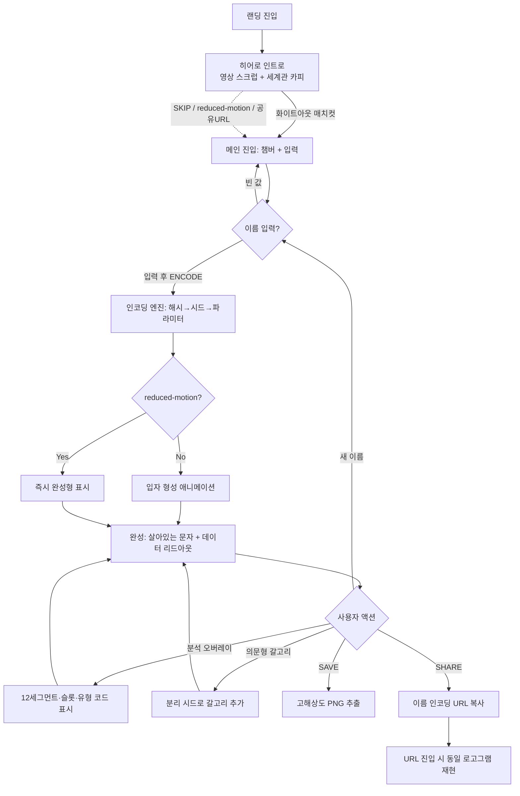
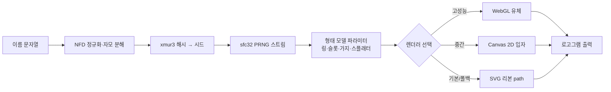

# Heptapod B Encoder — UX Flow

> 히어로 인트로의 스크롤 비트·카피 상세는 `06-hero-storyline.md` 참조.

## 유저 시나리오

### 시나리오 0: 히어로 인트로 진입 (스테이지 세그먼트 재생)

- **사용자**: 최초 진입(랜딩) 사용자
- **목표**: 외계 비행체 진입 여정을 **영상의 음성·진행단계와 함께** 체험하며 세계관을 흡수하고, 자연스럽게 인코더에 도달
- **내러티브 프레임**: "그들이 먼저 말을 걸었다 → 이제 당신이 답한다" (영상=발화/초대, 인코더=응답)
- **플로우**:
  1. 풀스크린 **고정 영상**(오디오 원본, Shot 02→11) 배경 위로 스토리 섹션이 자연 스크롤로 흘러간다. 타이틀(HEPTAPOD B) 다음, 첫 컨텐츠 섹션이 뷰포트 중앙에 진입하면 **영상 첫 세그먼트가 소리와 함께 자동재생**
  2. 각 스토리 섹션(B0~B6)이 중앙에 들어올 때(IntersectionObserver) 해당 **영상 세그먼트를 재생**(스크럽 아님). 세그먼트 끝에서 마지막 프레임 정지 후 다음 스테이지 대기. 위로 스크롤하면 그 세그먼트 되감기 재생. 카피: 비선형 문자 → 동시성 → "번역이 아니라 인코딩"
  3. 마지막 인코더 섹션이 자연 스크롤로 올라와 영상을 덮으며 진입 → **영상 정지 + OST 시작**(인트로=영상 음성 / 인코더=OST 단계 분리), 챔버는 영상 마지막 프레임(쿨 안개)에 정렬돼 이음새 없음
- **성공 조건**: 영상의 음성·스토리 단계가 살아있고, 스크롤이 활성 스테이지에 따라 영상을 재생하며, 인코더 도달 시 "응답할 차례" 동기가 형성됨
- **예외 상황**:
  - `prefers-reduced-motion` → 영상 자동재생/Lenis 생략, 컨텐츠 자연 스크롤 + 인코더 도달
  - 자동재생-소리 차단 → 첫 휠/클릭에서 unmute 보장(모바일은 muted 폴백)
  - `SKIP INTRO →` → 인코더 섹션으로 `scrollIntoView`
  - URL 공유 진입(`?name=`) → 인트로 생략, 인코더만 노출(재현 우선)
  > 스테이지↔세그먼트 매핑·카피 원문·영상 타임라인 상세: `06-hero-storyline.md`

### 시나리오 1: 이름 인코딩 (핵심 플로우)

- **사용자**: 처음 방문한 일반 사용자
- **목표**: 자기 이름이 헵타포드 B 로고그램으로 변환되는 것을 본다
- **플로우**:
  1. 챔버(안개 낀 서리 유리 공간)와 입력 필드가 있는 메인 화면 진입. 안개 배경은 평상시 천천히 안으로 전진(Z-depth creep). 배경음악(Heptapod B OST) 기본 재생 — 첫 상호작용에서 시작 (자동재생 정책)
  2. 이름 입력 (한글/영문) 후 ENCODE 실행 → **그 즉시** 시네마틱 전환음(whoosh+boom) + 안개 가속(dive) 동시 발화
  3. 이름 → 해시(xmur3) → 시드 → sfc32 PRNG → 형태 파라미터 결정 (순간)
  4. 입자들이 안개 속에서 모여들며 로고그램 형태로 응집 (형성 애니메이션)
  5. 완성 후 가장자리가 미세하게 살아 움직이는 "살아있는 문자" 상태 유지
  6. 데이터 리드아웃에 시드·NFD 유닛 수·활성 슬롯 등 표기

  > 오디오·Z-depth 모션 상세: `04-audio-and-motion.md`
- **성공 조건**: 같은 이름은 항상 같은 로고그램. 형태가 "규칙이 있어 보임"
- **예외 상황**:
  - 빈 입력 → ENCODE 비활성
  - `prefers-reduced-motion` → 형성 애니메이션·Z-depth 모션 생략, 즉시 완성형/정적 안개
  - 저성능/비WebGL 기기 → 렌더러 자동 폴백(WebGL→Canvas→SVG)
  - 브라우저 자동재생 차단 → 배경음악은 첫 클릭/키 입력에서 시작

### 시나리오 2: 해독 과정 탐색 (분석 오버레이)

- **사용자**: 어떻게 만들어지는지 궁금한 사용자
- **목표**: 로고그램의 구조(12세그먼트·슬롯·유형)를 이해
- **플로우**:
  1. 완성된 로고그램 위에서 "분석 오버레이" 토글 ON
  2. 12세그먼트 분할선·활성 슬롯 마커·가지 유형 코드가 영화적 연출로 오버레이
  3. 데이터 리드아웃의 각 값과 시각 요소가 연결되어 강조
  4. 토글 OFF로 순수 로고그램으로 복귀
- **성공 조건**: "발견된 구조가 아니라 심어둔 디자인 장치"라는 메시지가 전달됨
- **예외 상황**: 형성 애니메이션 진행 중에는 오버레이 토글 비활성(완성 후 활성)

### 시나리오 3: 표현 변형 (의문형 갈고리)

- **사용자**: 반복 탐색하는 사용자
- **목표**: 같은 이름의 변주(의문문 형태)를 본다
- **플로우**:
  1. "의문형 갈고리" 토글 ON
  2. 본체와 분리된 시드 스트림으로 갈고리 장식만 추가
  3. 본체 형태는 한 픽셀도 변하지 않음
- **성공 조건**: 토글이 본체 형태에 영향 없음 (시드 분리 검증)
- **예외 상황**: 없음

### 시나리오 4: 저장 및 공유

- **사용자**: 결과물을 간직/공유하려는 사용자
- **목표**: 고해상도 PNG 저장 또는 링크 공유
- **플로우**:
  1. SAVE → 현재 로고그램을 고해상도 PNG로 추출(canvas toBlob)
  2. SHARE → 이름을 인코딩한 URL 쿼리 복사
  3. 공유 URL 진입 시 → 쿼리에서 이름 디코딩 → 동일 로고그램 즉시 재현
- **성공 조건**: URL만으로 완전 재현(결정론). 저장 이미지가 화면 품질 이상
- **예외 상황**: 비WebGL 기기 공유 진입 시에도 SVG로 동일 형태 재현(질감만 다름)

### 시나리오 5: 제작 비하인드 (인터랙티브 에세이)

- **사용자**: 콘텐츠를 깊이 소비하는 사용자
- **목표**: 헵타포드 B가 어떻게 reverse-engineering 되었는지 읽는다
- **플로우**:
  1. 메인 하단 또는 별도 섹션에서 "How it works / The real story" 진입
  2. 영화 제작 실체(연출 우선·사후 체계화) + 본 프로젝트의 동일 방법론 서술
  3. 강한 사피어-워프 가설의 학계 위치 등 정직한 한계 명시
- **성공 조건**: "번역이 아니라 인코딩"이라는 프레임이 일관되게 전달
- **예외 상황**: 없음

## UX 플로우





## 정보 구조 (IA)

```
Heptapod B Encoder
├── 히어로 인트로 (Hero Intro — 영상 스크러빙)
│   ├── 스크럽 영상 (sticky, 47s, Shot 02→11)
│   ├── 세계관 카피 비트 (B0~B6 페이드 오버레이)
│   ├── SKIP INTRO 컨트롤
│   └── 화이트아웃 매치컷 → 챔버 핸드오프
├── 메인 (Encoder)
│   ├── 챔버 (로고그램 렌더 영역, 정방형, 서리 유리, 안개 Z-depth 모션)
│   ├── 타이틀 블록 (Heptapod B + 배경음악 토글 ► PLAY OST)
│   ├── 입력 컨트롤 (이름 입력 + ENCODE)
│   ├── 토글 컨트롤 (분석 오버레이 / 의문형 갈고리)
│   ├── 데이터 리드아웃 (시드·NFD·슬롯·무게중심)
│   └── 액션 (SAVE / SHARE)
├── 제작 비하인드 (The Real Story)
│   ├── 영화 제작 실체 (연출 우선·사후 체계화)
│   ├── 본 프로젝트 방법론 (동일 reverse-engineering)
│   └── 정직한 한계 (사피어-워프·인코더 ≠ 번역기)
└── 푸터
    └── 정직한 카피 (인코딩 명시) + 출처
```

## 데이터 모델

프론트엔드 상태/엔티티 중심.

| 엔티티 | 주요 필드 | 관계 |
|--------|----------|------|
| `EncodeInput` | name(string), hasQuestionHook(bool), showAnalysis(bool) | 사용자 입력 상태 |
| `Seed` | hash(uint32), prng(sfc32 state), nfdUnits(string[]) | name으로부터 파생(순수 함수) |
| `LogogramModel` | ring{radius, harmonics[], weightCenterAngle}, slots[12], branches[], splatter[], questionHook | Seed로부터 결정. 렌더러 입력 |
| `Branch` | type('wisp'\|'hook'\|'blob'\|'spike'), direction, length, curl, widthMul, angleJitter, droplet | LogogramModel에 N개 포함 |
| `Slot` | index(0-11), active(bool), branchRef | 12개 고정, 활성은 시드로 선택 |
| `Readout` | seedHash, nfdCount, activeSegments, weightCenterAngle, slotStates[12] | LogogramModel 파생 표시값 |
| `RenderConfig` | tier('webgl'\|'canvas'\|'svg'), reducedMotion(bool) | 디바이스 능력 감지 결과 |

**아키텍처 분리 원칙** (기획서 4.1): `encode(name) → Seed` (순수) / `buildModel(seed) → LogogramModel` (데이터) / `render(model, config)` (교체 가능). 앞 두 단계는 모든 렌더러가 공유.

## 컴포넌트 리스트

기존 디자인 시스템 재활용 우선. 핵심 렌더링은 본 프로젝트 고유라 신규 불가피.

| 컴포넌트 | 용도 | 구분 | 기존 경로 / 비고 |
|----------|------|------|-----------------|
| TextField | 이름 입력 | 재활용 | MUI `components/input/TextField` — 모노스페이스·차가운 톤 sx 적용 |
| Button | ENCODE / SAVE / SHARE | 재활용 | MUI `components/input/Button` |
| Switch | 분석 오버레이·의문형 갈고리 토글 | 재활용 | MUI `components/input/Switch` |
| Table | 데이터 리드아웃(12슬롯 상태) | 재활용 | MUI `components/data-display/Table` — 모노스페이스 sx |
| RatioContainer | 챔버 정방형 비율 고정 | 재활용 | `components/container/RatioContainer.jsx` |
| SectionContainer | 제작 비하인드 섹션 | 재활용 | `components/container/SectionContainer.jsx` |
| FadeTransition | 섹션·오버레이·**인트로 카피 비트** 등장 페이드 | 재활용 | `components/motion/FadeTransition.jsx` |
| VideoScrubbing | 히어로 인트로 스크롤→영상 프레임 스크럽 | 재활용 | `components/scroll/VideoScrubbing.jsx` |
| ScrambleText | 데이터 리드아웃 값 전환 연출(연구 장비 톤) | 재활용 | `components/kinetic-typography/ScrambleText.jsx` |
| GradientOverlay | 안개 배경의 기반(Three.js·Simplex Noise·필름 그레인) | 수정 | `components/dynamic-color/GradientOverlay.jsx` — 저채도 모노크롬 안개로 파라미터 조정 |
| StyledParagraph / Title | 제작 비하인드 텍스트 | 재활용 | `components/typography/` |
| **HeptapodHeroIntro** | 영상 스크럽 + 카피 비트 + 챔버 매치컷 핸드오프 컨테이너 | 신규 | 카테고리: `templates` (또는 `motion`). 상세: `06-hero-storyline.md` |
| **LogogramChamber** | 로고그램 렌더 컨테이너(서리 유리·안개·렌더러 마운트) | 신규 | 카테고리: `motion` |
| **LogogramRenderer (SVG)** | MVP 렌더러: 리본 path + feTurbulence 번짐 + 다층 opacity 농담 | 신규 | 카테고리: `motion` |
| **LogogramRenderer (Canvas)** | 입자 형성 애니메이션: jitter + 단순 boids 응집 | 신규 | 카테고리: `motion` |
| **LogogramRenderer (WebGL)** | 유체 시뮬레이션(Navier-Stokes) 밀도 소스 주입 | 신규 | 카테고리: `motion` |
| **AnalysisOverlay** | 12세그먼트 분할선·슬롯 마커·유형 코드 오버레이 | 신규 | 카테고리: `overlay-feedback` (확정) |
| **DataReadout** | 시드·NFD·슬롯 상태 모노스페이스 패널 | 신규 | 카테고리: `data-display` (Table 조합) |

**신규 로직 모듈** (컴포넌트 아님 — `utils/heptapod/` 배치):
- `encode.js`: xmur3 해시 + sfc32 PRNG + NFD 분해 (순수 함수)
- `buildModel.js` / `reversibleModel.js` / `reversibleCodec.js`: 시드 → LogogramModel 변환 + 가역 인코딩/디코딩
- `logogramParticles.js`: 입자 형성 타임라인(`totalMs`) 생성 (Canvas 렌더러 입력)
- `detectRenderTier.js`: WebGL/Canvas 능력 감지 + reduced-motion
- `exportPng.js`: 고해상도 PNG 추출
- `ambientAudio.js`: 시네마틱 효과음 합성 컨트롤러 (`04-audio-and-motion.md` §1.1)
- `backgroundMusic.js`: YouTube IFrame 배경음악 컨트롤러 — API key 불필요 (`04-audio-and-motion.md` §1.2)
