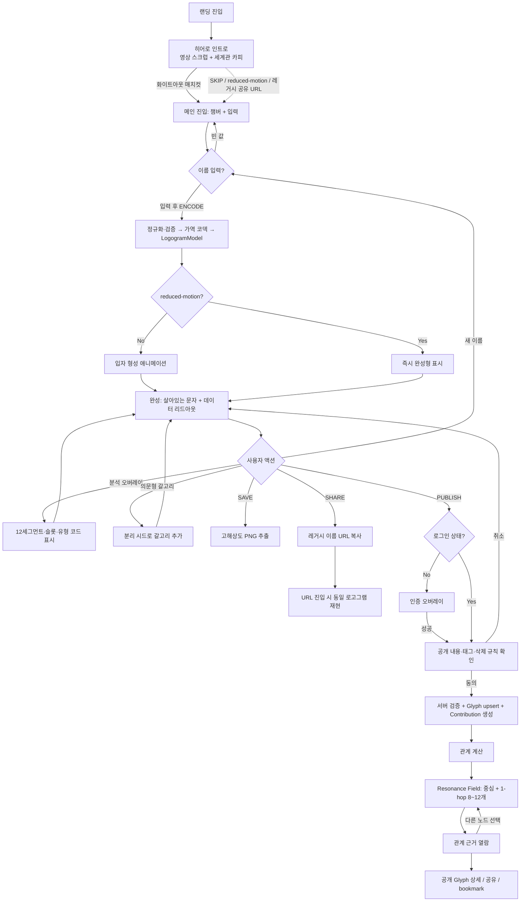
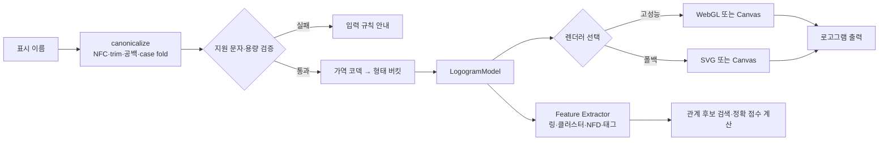

# Heptapod B — The Response Archive — UX Flow

> 히어로 인트로의 스크롤 비트·카피 상세는 `06-hero-storyline.md` 참조.
> 최초 확장 설계와 장기 목표를 포함한 UX 문서다. **2026-09-06 로컬 구현 기준은 아래 적용 현황이 우선**하며, 상세 변경·배포 조건은 `16-resonance-implementation.md` 참조. 운영 DB 적용 여부를 이 문서로 추정하지 않는다.

## 적용 현황 · 2026-09-06

유형 피드 적용: 분석 reading·Archive 유형 피드/개인 확대·공유 상세·단일 네이티브 공유 문구는 같은 유형명과 서사를 재사용한다. 예를 들어 상호성+여백은 ‘경계의 가교’로 연결하고, 의미 선택 시 이 표식의 실제 가지·틈·먹 위치를 설명한다. 성격을 판정하지 않으며 기존 OG 이미지는 그대로다. 구현·검증 범위는 `19-archetype-feed.md` 참조.

페이지 흐름: 랜딩 `/` → 실제 영상 재생 종료 → 마지막 캡션 퇴장·안개 전환(650ms, 모션 감소 시 즉시) → `/canvas` 자동 리다이렉트 → 이름 입력·표식 생성 → Archive 클릭 시 `/archive` 이동. 랜딩은 완료 이벤트만 전달하고 라우트가 이동을 소유한다. 자동 이동은 replace라 뒤로 가기로 완료한 인트로가 바로 반복되지 않으며, Archive 이동은 push라 뒤로 가면 Canvas로 돌아간다. `/canvas` 직접 진입도 가능하고 기존 `/?name=...`·`/?create=1`은 이름·v·hash를 보존한 Canvas 주소로 replace한다(create 플래그는 제거). 새로 입력한 이름은 URL에 쓰지 않는다. SKIP·재시도·모션 감소에서도 실제 영상 완주 조건을 유지한다. 랜딩과 Canvas를 동시에 마운트하지 않으며 이동할 때 인트로 영상·스크럽 사운드·스크롤 잠금을 해제한다. AppRoutes는 경로 등록, EncoderRoutes는 완료/쿼리 어댑터, paths는 경로·레거시 쿼리 계약, App은 전역 provider·Lenis 수명을 담당한다.

이름 입력 → Enter로 표식 생성 → 분석 / 공개·공유 / Archive. 결과 화면은 기존 풀스크린 챔버·중앙 표식과 우측 상단 오버레이 방식을 유지한다. 우측 메타데이터는 덩어리 수·가닥 수·무게중심·링 상태의 네 줄(각 32px)로 고정한다. ANALYSIS를 켜도 제목·행 수·패널 높이·버튼 위치는 그대로이고 상세 분석만 추가된다. 데스크톱은 좌측 의미 판독, 모바일은 같은 ANALYSIS 버튼으로 동일한 의미 판독 Dialog를 연다. 초록 라인·빨간 정점·순차 스캔·비프 효과는 유지하며 선택한 의미의 실제 부위를 그 위에 강조한다. 우측 기능은 ANALYSIS / Publish and share / Archive의 세 가지 진입만 남기며 SAVE·하단 의미 설명·의미군 링크·Compare another name은 제거한다. 타이핑 프리뷰·표식의 하위 단위 분해, 중앙 하단 입력, 언어·사운드는 유지한다. 공개·공유는 하나의 버튼으로 명시적 동의 후 공개하고, 완료 화면의 별도 Share 클릭으로 공유한다. 공개 후에는 같은 버튼이 Share로 바뀌며 UUID 링크만 공유한다. 공개 실패·취소는 입력을 보존하고, 공유 실패는 공개 상태를 되돌리거나 재게시하지 않는다. 공개 완료 후에도 결과 화면에 남는다. 이전 이름 링크는 기존 표식을 재현하고 공개 전 명시적으로 새 버전을 만든다. 아래 최초 시나리오의 SAVE·이름 쿼리 신규 공유는 적용하지 않는다. 분석은 제거하지 않으며 형성 완료 후 사용자가 켜는 방식이다.

Archive 흐름: 기본 계열 상징(0depth) → 유형별 세로 피드(1depth) → 개인 확대. 도래/수용/상호성 × 동시성/여백/잔향의 8조합을 24개 유형명·짧은 서사·저작 상징으로 정의한다. 실제 구성원이 있는 유형만 카탈로그 순서로 보여주고 각 제목 아래 사람들의 표식을 모바일 2열·데스크톱 3열로 바로 표시한다. 탭·개수 분포·유형 선택용 중간 depth는 없다. 정확한 meaningKey로 개인은 한 번만 나타난다. partial/invalid는 false로 바꾸거나 유형을 강제하지 않고 기존 범위에 남긴다. 상징은 사람/평균/공개 기록이 아니다. 24개는 조건부 경우의 수이지 현재 관측 수나 모든 이름의 도달 보장이 아니다. 상세 계약은 `19-archetype-feed.md` 참조.

개인 확대는 glyph=<공개 UUID>로 보존한다. 신규 URL은 meta를 생성하지 않고 기존 meta 링크도 탭 정렬 없이 유형 피드로 읽는다. group·modifiers AND·status 링크의 정확한 범위는 유지한다. 개인 Dialog와 이전/다음은 같은 피드 순서를 사용하며 뒤의 Canvas를 마운트 상태로 유지한다. 확대·닫기로 스크롤을 초기화하지 않는다. Canvas 형성·안개·계열 전환·감소 모션·전역 Lenis를 보존한다. 판독은 개인의 접힌 영역에 남긴다. 관측 기록·내 응답·미판독 흔적 메뉴 및 전용 조회·집계·Drawer·footer는 복원하지 않는다.

추가 탐색은 `/glyph/:id` 주요 정밀 관계 3개, `/field/:id` 지도, `/compare/:leftId/:rightId?` 의미/정밀 비교다. Archive·상세·비교의 판독기는 동일하며 로컬 이름은 공개할 때만 명시적 동의를 받는다. 본인 응답 화면·스토리·전용 기여 조회 훅·메뉴 번역을 삭제했고 `/me`는 `/archive`로 replace한다. 공개 안내도 삭제된 메뉴와 계정 연결을 더 이상 안내하지 않는다. 공개·소유권·철회 서버 계약과 이미 저장된 DB 기록은 유지한다. `/map`, `/story`, bookmark/report UI는 구현된 경로가 아니다. 정밀 군집은 `17-archive-clustering.md`, 의미군 데이터 계약은 `18-meaning-groups.md` 참조. 이번 단순화는 프론트 표시·탐색 변경이며 DB·분류 규칙·provider 계약 변경이나 배포를 포함하지 않는다.

분석 읽기: 도래/수용/상호성의 기본 계열과 동시성/여백/잔향을 새로 분류하지 않고 기존 판독기와 카탈로그에서 가져온다. 의미 선택 → 공통 정의 → 이 표식의 방향·초점 수·틈·먹 위치 → 실제 부위 번호로 연결한다. 같은 의미군 안의 서로 다른 배치를 설명하며 이름의 어원·성격·전역 유일성은 추정하지 않는다. 시계 방향 문구는 근사 안내이고 강조 좌표는 원본 각도를 유지한다. 설명 영역은 고정 높이, 중앙 표식/스캔과 우상단 패널은 의미 선택으로 다시 형성하거나 이동하지 않는다. Archive 개인의 접힌 판독과 공유 상세도 같은 GlyphMeaningSummary reading 변형과 buildMeaningReading을 사용한다. 미확인은 부재가 아니고, 비가역 이름도 실제 모델로 읽는다. 수식·정수 변환 설명만 제거했으며 초록 삼각망·정점·스캔 연출은 제거하지 않는다. DB·의미 버전·분류 임계값은 변경하지 않는다.

| 항목 | 현재 구현 | 최초 설계와의 차이 |
|---|---|---|
| 라우트 | `/` 영상 랜딩 → `/canvas` 독립 생성 → `/archive` | 랜딩 내부에 숨긴 인코더·children 핸드오프 제거. 실제 ended 후 replace, Archive 클릭은 push. 기존 쿼리 링크 호환 |
| 이름 표식 | canonical v2, SHA-256 공개 정체성 | 지원 이름의 코덱 미지원·overflow는 비가역 결정론 모드. 글자를 버리지 않음 |
| 관계 | v3: 변환된 model_data에서 FORM(전체 형태/일부 구조), 실제 본체 VARIANT | 원문 철자·자모·포함·태그는 연결 계산에서 제외. 이름은 표식의 표시/출처 |
| 의미군 | v1: 도래/수용/상호성 + 동시성/여백/잔향. 관측과 해석 분리 | 의미가 같아도 정밀 관계/점수를 생성하지 않음. 부분 판독은 확인된 의미만 표시 |
| 군집 | 전체 형상·같은 가지·열린 틈+먹 패턴별 중첩 군집. 기존 공개 표본에서 local 계산 | 같은 군집은 모든 구성원 쌍과 고정된 관측 부위를 검증. 연결 사슬을 그대로 합치지 않음. 현재 미소속도 보존 |
| 후보 | 개발: 실제 공개 snapshot 최대 200개. API: 최근 공개/기존 이웃 최대 300개 | 요청 시 현재 표본 계산. 이름 접두 검색 없음. 영구 전체 그래프·background job 아님 |
| 노출 | 이웃 ID당 관측 근거 병합, 전체/부분 수준과 관측 부위별 순위 후 교대 | 관계 없는 표식을 억지로 채우지 않음. 목록 최대 24개, 지도 모바일6/데스크톱12 |
| 조작 | 노드 선택은 근거, 별도 ‘이 이름에서 탐색’이 중심 이동 | 한 번의 클릭이 두 동작을 수행하지 않음. 모바일/감소 모션은 목록 기본 |
| 공개 | 동의 후 익명 인증 또는 기존 소유자, 서버 재생성·트랜잭션 | 가입 필수 장벽 없음. 요청 실패는 실패로 표시하고 입력 보존 |
| 응답 관리 | 내 응답 UI·전용 조회 제거, `/me`는 Archive로 이동 | 소유권·철회 서버 계약 및 기존 DB 기록은 보존. 현재 프론트 철회 동선 없음 |
| 공유 | UUID와 실제 두 형태 PNG. 의미 reading=meaning&mv=1, 명시 정밀 reading=precision 앱 링크 | 의미와 기존 정밀 OG를 혼합하지 않음. 미지원 의미 버전은 재해석하지 않음. 기존 옵션 없는 OG 공유 유지 |

아래 원안의 상위 K 영구 저장·태그 추천·로그인 Overlay·북마크/신고는 후속 계획이다. ‘전체 아카이브 최초’ 같은 주장은 현재 표본만으로 할 수 없으므로 사용하지 않는다.

## 제품 세계관

### 한 줄 정의

> 그들은 문장을 한 번에 보았다. 우리는 이름을 하나씩 남겼다. 아카이브는 흩어진 응답을 하나의 발화로 연결한다.

- 기존 히어로 인트로는 **The Signal**: 그들이 먼저 말을 건네는 구간이다.
- 이름 인코더는 **Your Response**: 사용자가 이름을 하나의 사고 단위로 응축하는 구간이다.
- 공개 아카이브는 **The Archive Answers**: 원문에서는 드러나지 않던 공통 구조를 **Heptapod B 형태로 변환한 후** 발견하는 구간이다. 문자 공유로 연결한 뒤 표식으로 장식하는 구조가 아니다.
- 언어맵은 **The Utterance**: 각각의 이름이 독립 게시물이 아니라 하나의 비선형 문장을 이루는 구간이다.
- 이 분류와 관계는 영화의 공식 언어학 설정이 아니라, 헵타포드 B의 비선형성·동시성을 본 프로젝트가 해석한 세계관임을 명시한다.

### 세계관 용어

| 제품 용어 | UX 의미 | 데이터 의미 |
|---|---|---|
| **Response** | 사용자가 공개한 이름 로고그램 | `Glyph`에 대한 사용자의 `GlyphContribution` |
| **Archive** | 공개 Response가 보존되는 공간 | 공개 상태의 `glyphs`와 기여 데이터 |
| **Resonance** | 두 로고그램 사이에서 발견된 설명 가능한 관계 | `GlyphRelation` |
| **Resonance Field** | 선택한 Response 중심의 언어맵 | glyph node + relation edge 그래프 |
| **Observer** | 생성·공개·탐색하는 사용자 | Supabase Auth 사용자 + `Profile` |
| **Contour Lineage** | 조형 특징으로 분류한 관측 계보 | 주 클러스터 유형 × 무게중심 사분면 |

### 내러티브 원칙

1. **게시물 피드가 아니라 하나의 장면**: 시간순 목록보다 선택한 글리프를 중심으로 관계가 동시에 드러나는 구조를 우선한다.
2. **변환 후의 공명이 핵심**: 모든 Resonance는 저장된 링·개구부·가지·필압/먹 분포를 비교한다. 이름의 철자만 바꿔 표시해도 동일 모델 쌍의 연결·점수·이유는 바뀌지 않는다.
3. **관측과 해석 구분**: 전체 형태가 닮은 것과 일부 구조가 닮은 것을 구분한다. 원문의 의미·사람의 성격·친분은 추정하지 않으며 태그도 형태 관계의 대체 근거가 아니다.
4. **고립도 세계관으로 수용**: 기준을 넘는 관계가 없으면 ‘현재 비교한 이름들에서는 설명할 수 있는 연결을 찾지 못했습니다’로 표시한다. 표본만으로 최초·유일함을 주장하지 않는다.
5. **개인보다 집단 발화**: 인기·팔로워·좋아요 수로 노드 크기를 키우지 않는다. 노드의 시각적 위계는 현재 탐색 맥락으로만 결정한다.

## 유저 시나리오

### 시나리오 0: 히어로 인트로 진입 (스크롤 스크러빙)

- **사용자**: 최초 진입(랜딩) 사용자
- **목표**: 외계 비행체 진입 여정을 **스크롤로 직접 스크럽하며** 세계관을 흡수하고, 자연스럽게 인코더에 도달
- **내러티브 프레임**: "그들이 먼저 말을 걸었다 → 이제 당신이 답한다" (영상=발화/초대, 인코더=응답)
- **플로우**:
  1. 타이틀 셀(100vh): `HEPTAPOD B` + **START**. 누르기 전엔 스크롤 잠금(강제). START 클릭 = 사운드 언락 → 잠금 해제 + 첫 비트로 부드럽게 이동
  2. 트랙(타이틀 1셀 + 비트 셀 6.4셀, 1셀 = 100vh): 스크롤 위치가 영상 `currentTime` 을 **양방향으로 스크럽**(muted). 비트별 셀 가중치가 페이싱을 정하고(읽기 비트 길게, 액션 비트 짧게) Lenis 감쇠가 속도를 연속화한다
  3. 사운드: 영상 오디오를 비트 구간대로 잘라낸 클립(B0~B5) + 베드 루프 + 오프닝 드론이 스크롤 위치에 결속되어 난다. 스크롤이 멈추면 클립은 잦아들고 베드만 남으며, 완주하면 전부 무음. 우하단 토글
  4. 캡션(B0~B5)은 트랙 좌표에 실배치되어 자연 스크롤로 영상 위를 지나가고(애니메이션 없음), 하단 HUD 가 `01 — 06` 카운터·진행바를 보여준다
  5. 트랙 뒤 핸드오프 스페이서(120vh) 진입 → 고정 캔버스(인코더)가 마지막 프레임(화이트아웃) 위에서 제자리 fade-in → **OST 시작**(인트로=스크럽 사운드 / 인코더=OST 단계 분리)
- **성공 조건**: 스크롤 연속성이 끊기지 않고(잠금 없음, 역방향 가능) 화면과 소리가 같은 지점을 가리키며, 인코더 도달 시 "응답할 차례" 동기가 형성됨
- **예외 상황**:
  - `prefers-reduced-motion` → 스크럽·Lenis 생략(정지 프레임), START 게이트와 캡션 자연 스크롤만
  - iOS → 첫 제스처 완료(touchend/pointerup)에서 디코더 예열 후 스크럽. 무음 스위치는 audioSession 'playback' 으로 우회
  - `SKIP INTRO →` → 잠금 해제 + 핸드오프로 이동(스크럽 사운드 무음 → OST)
  - URL 공유 진입(`?name=`) → 인트로 생략, 인코더만 노출(재현 우선)
  > 셀 가중치·사운드 엔진·자산 빌드 상세: `07-scroll-scrub-sound-plan.md` · 비트·카피: `06-hero-storyline.md`

### 시나리오 1: 이름 인코딩 (핵심 플로우)

- **사용자**: 처음 방문한 일반 사용자
- **목표**: 자기 이름이 헵타포드 B 로고그램으로 변환되는 것을 본다
- **플로우**:
  1. 챔버(안개 낀 서리 유리 공간)와 입력 필드가 있는 메인 화면 진입. 안개 배경은 평상시 천천히 안으로 전진(Z-depth creep). 배경음악(Heptapod B OST) 기본 재생 — 첫 상호작용에서 시작 (자동재생 정책)
  2. 이름 입력 (한글/영문) 후 ENCODE 실행 → **그 즉시** 시네마틱 전환음(whoosh+boom) + 안개 가속(dive) 동시 발화
  3. 이름 정규화 → 가역 코덱 → 형태 버킷 → 결정론적 `LogogramModel` 생성 (순간). 공개 버전에서는 지원 문자·길이·overflow를 조용히 무시하지 않고 입력 단계에서 설명한다
  4. 입자들이 안개 속에서 모여들며 로고그램 형태로 응집 (형성 애니메이션)
  5. 완성 후 가장자리가 미세하게 살아 움직이는 "살아있는 문자" 상태 유지
  6. 데이터 리드아웃에 시드·NFD 유닛 수·활성 슬롯 등 표기

  > 오디오·Z-depth 모션 상세: `04-audio-and-motion.md`
- **성공 조건**: 같은 이름은 항상 같은 로고그램. 형태가 "규칙이 있어 보임"
- **예외 상황**:
  - 빈 입력 → ENCODE 비활성
  - `prefers-reduced-motion` → 형성 애니메이션·Z-depth 모션 생략, 즉시 완성형/정적 안개
  - 저성능/비WebGL 기기 → 렌더러 자동 폴백(WebGL→Canvas→SVG)
  - 브라우저 자동재생 차단 → 배경음악은 첫 클릭/키 입력에서 시작

### 시나리오 2: 해독 과정 탐색 (분석 오버레이)

- **사용자**: 어떻게 만들어지는지 궁금한 사용자
- **목표**: 로고그램의 구조(12세그먼트·슬롯·유형)를 이해
- **플로우**:
  1. 완성된 로고그램 위에서 "분석 오버레이" 토글 ON
  2. 12세그먼트 분할선·활성 슬롯 마커·가지 유형 코드가 영화적 연출로 오버레이
  3. 데이터 리드아웃의 각 값과 시각 요소가 연결되어 강조
  4. 토글 OFF로 순수 로고그램으로 복귀
- **성공 조건**: "발견된 구조가 아니라 심어둔 디자인 장치"라는 메시지가 전달됨
- **예외 상황**: 형성 애니메이션 진행 중에는 오버레이 토글 비활성(완성 후 활성)

### 시나리오 3: 표현 변형 (의문형 갈고리)

- **사용자**: 반복 탐색하는 사용자
- **목표**: 같은 이름의 변주(의문문 형태)를 본다
- **플로우**:
  1. "의문형 갈고리" 토글 ON
  2. 본체와 분리된 시드 스트림으로 갈고리 장식만 추가
  3. 본체 형태는 한 픽셀도 변하지 않음
- **성공 조건**: 토글이 본체 형태에 영향 없음 (시드 분리 검증)
- **예외 상황**: 없음

### 시나리오 4: 로컬 저장 및 레거시 공유

- **사용자**: 결과물을 간직/공유하려는 사용자
- **목표**: 로그인 없이 고해상도 PNG를 저장하거나 현재 결정론 링크를 공유
- **플로우**:
  1. SAVE → 현재 로고그램을 고해상도 PNG로 추출(canvas toBlob)
  2. SHARE → 이름을 인코딩한 기존 URL 쿼리 복사. 이름이 URL에 포함된다는 사실을 안내
  3. 공유 URL 진입 시 → 쿼리에서 이름 디코딩 → 동일 로고그램 즉시 재현
- **성공 조건**: URL만으로 완전 재현(결정론). 저장 이미지가 화면 품질 이상
- **예외 상황**:
  - 비WebGL 기기 공유 진입 시에도 폴백 렌더러로 동일 형태 재현(질감만 다름)
  - 공개 아카이브에 저장된 Response는 이름 대신 opaque public ID를 사용하는 `/glyph/:publicId` 링크를 우선 제공

### 시나리오 5: Response 공개

- **사용자**: 완성한 로고그램을 공동 아카이브에 남기려는 사용자
- **목표**: 공개 범위와 데이터 사용을 이해한 상태로 자신의 Response를 저장
- **플로우**:
  1. 완성 상태에서 `PUBLISH TO ARCHIVE` 선택
  2. 비로그인 상태면 인증 오버레이 진입. 이름·모델·입력 상태는 로컬에 유지
  3. 인증 완료 후 동일한 공개 확인 단계로 복귀
  4. 공개될 이름, 로고그램, 선택 태그 최대 3개, 공개 후 삭제 규칙 확인
  5. 명시적 공개 동의 후 서버가 정규화·지원 문자·overflow·모델 일치 여부 검증
  6. 같은 canonical name과 encoder version이 이미 있으면 기존 `Glyph`에 기여를 추가하고, 없으면 새 `Glyph` 생성
  7. 저장 완료 즉시 현재 글리프가 중앙에 고정되고 관계 계산 상태로 전환
- **성공 조건**: 사용자가 무엇이 공개되는지 알고, 로그인 전후에 생성 결과가 유실되지 않으며, 같은 이름이 중복 노드가 되지 않음
- **예외 상황**:
  - 인증 취소 → 인코더 상태로 복귀, 로컬 결과 유지
  - 검증 실패 → 저장하지 않고 실패 원인과 수정 가능한 입력 규칙 표시
  - 이미 본인이 공개한 동일 Glyph → 중복 contribution을 만들지 않고 기존 상세로 이동
  - 관계 계산 실패 → 공개는 유지하고 `MAPPING RESONANCE` 상태에서 재시도

### 시나리오 6: Resonance Field 탐색

- **사용자**: 자신의 Response 또는 공유받은 Response와 연결된 이름을 탐색하려는 사용자
- **목표**: 어떤 이름이 왜 연결됐는지 이해하고 다른 Response로 이동
- **플로우**:
  1. 선택한 Glyph를 중심 노드로 두고 직접 관계 8~12개를 안개 속에서 점진적으로 형성
  2. 선 스타일로 주 관측 부위(가지/개구부/잉크/링)와 질문의 변주를 구분
  3. 연결선 또는 주변 노드를 선택하면 관계 점수와 근거 문장을 `RelationInspector`에 표시
  4. 근거 패널에서 실제 두 표식의 대응 부위를 확인한 후 별도 탐색 버튼으로 중심을 이동
  5. 가지 구조·개구부·잉크 분포·링 윤곽 필터로 관측 부위를 분리 탐색. 전체 형태/일부 구조의 차이를 설명
  6. 모바일·키보드·스크린리더 환경에서는 동일 데이터를 관계 목록으로 탐색
- **성공 조건**: 사용자가 1회 이상의 관계 근거를 열람하고, 지도에서 다른 Response로 끊김 없이 이동
- **예외 상황**:
  - 관계 0개 → 현재 비교 범위의 무관계 안내 + 직접 이름 비교 CTA
  - 관계가 매우 많음 → 유형별 상한과 다양성 규칙으로 최대 12개만 노출
  - 네트워크 실패 → 중심 Glyph는 캐시/로컬 모델로 유지하고 관계 영역만 재시도
  - `prefers-reduced-motion` → 노드 이동·응집 생략, 정적 배치와 목록을 즉시 표시

### 시나리오 7: 공개 Glyph 상세 및 개인 아카이브

- **사용자**: 공유 링크 방문자 또는 자신이 공개한 Response를 관리하는 사용자
- **목표**: 하나의 Glyph와 기여 맥락을 보고 공유·저장·공개 취소
- **플로우**:
  1. `/glyph/:publicId`에서 로고그램, 표시 이름, Contour Lineage, 주요 Resonance를 확인
  2. 방문자는 opaque URL을 복사하거나 로그인 후 bookmark
  3. 소유자는 `/me`에서 자신이 공개한 Response와 bookmark를 확인
  4. 공개 취소 시 자신의 contribution만 제거. 마지막 기여자라면 Glyph와 관계를 함께 비공개/삭제 처리
- **성공 조건**: 공개 링크가 안정적으로 재현되고, 본인 데이터만 관리할 수 있음
- **예외 상황**:
  - 숨김·삭제된 Glyph → 이름과 모델을 노출하지 않는 unavailable 상태
  - 여러 사용자가 같은 Glyph를 공개한 경우 → 한 사용자의 공개 취소가 다른 기여를 삭제하지 않음

### 시나리오 8: 제작 비하인드 (인터랙티브 에세이)

- **사용자**: 콘텐츠를 깊이 소비하는 사용자
- **목표**: 헵타포드 B가 어떻게 reverse-engineering 되었는지 읽는다
- **플로우**:
  1. 메인 하단 또는 별도 섹션에서 "How it works / The real story" 진입
  2. 영화 제작 실체(연출 우선·사후 체계화) + 본 프로젝트의 동일 방법론 서술
  3. 강한 사피어-워프 가설의 학계 위치 등 정직한 한계 명시
- **성공 조건**: "번역이 아니라 인코딩"이라는 프레임이 일관되게 전달
- **예외 상황**: 없음

## UX 플로우





## 정보 구조 (IA)

```text
Heptapod B — The Response Archive
├── / — The Signal + Your Response
│   ├── 히어로 인트로 (스크럽 영상·세계관 카피·SKIP)
│   ├── 챔버 (이름 입력·로고그램 형성·분석·의문형)
│   ├── 로컬 액션 (SAVE PNG·레거시 SHARE)
│   └── 공개 액션 (PUBLISH TO ARCHIVE)
├── 인증 오버레이
│   ├── 로그인 / 가입
│   └── 인증 후 publish 문맥 복귀
├── /map/:publicId? — Resonance Field
│   ├── 중심 Glyph + 1-hop 관계
│   ├── 관계 유형 필터
│   ├── Relation Inspector
│   └── 접근성 관계 목록
├── /glyph/:publicId — Response Detail
│   ├── 로고그램·표시 이름·Contour Lineage
│   ├── 주요 Resonance와 근거
│   └── 공유·bookmark·소유자 공개 취소
├── /me — My Archive
│   ├── 내가 공개한 Response
│   └── bookmark
├── /story — The Real Story
│   ├── 영화 제작 실체와 reverse-engineering
│   ├── 언어맵의 관계 계산 원리
│   └── 인코더 ≠ 번역기·공식 언어학 아님
└── 공통
    ├── 공개·개인정보 안내
    ├── 신고·숨김·unavailable 상태
    └── 정직한 출처와 한계 카피
```

## 페이지 리스트

| 페이지 / 표면 | 경로 | 주요 사용자 행동 | 다루는 데이터 | 인증 |
|---|---|---|---|---|
| The Signal + Encoder | `/` | 인트로 탐색, 이름 인코딩, 분석, PNG 저장, publish 시작 | `EncodeSession`, `LogogramModel`, `AuthIdentity`, `Glyph` | 탐색 불필요, publish 시 필요 |
| Auth Overlay | 현재 경로 위 overlay | 로그인·가입, publish 문맥 복귀 | `AuthIdentity`, `Profile` | 비회원 진입 |
| Resonance Field | `/map`, `/map/:publicId` | 중심 이동, 관계 필터, 근거 열람 | `Glyph`, `GlyphRelation`, 공개 기여 집계 | 읽기 불필요 |
| Response Detail | `/glyph/:publicId` | 상세 열람, opaque 링크 공유, bookmark, 공개 취소 | `Glyph`, `GlyphContribution`, `GlyphRelation`, `Bookmark`, `Report` | 읽기 불필요, 쓰기 필요 |
| My Archive | `/me` | 내 기여·bookmark 조회 및 삭제 | `Profile`, `GlyphContribution`, `Bookmark` | 필요 |
| The Real Story | `/story` | 세계관·알고리즘·한계 읽기 | 정적 콘텐츠, 공개 관계 예시 | 불필요 |

## 데이터 모델

### 데이터 모델 카드 A — Encode Session (클라이언트 전용)

- **목적**: 사용자가 입력·분석·드릴다운·렌더링·publish 직전까지 만든 상태를 보존한다.
- **포함**: 입력 원문, canonical name 후보, 의문형 여부, `LogogramModel`, 분석 토글, 렌더러 설정, 인증 전 publish draft.
- **소유/권한**: 현재 브라우저 세션의 사용자만 사용한다. publish 동의 전에는 DB에 저장하지 않는다.
- **생명주기**: 입력 또는 레거시 공유 URL 진입 시 생성 → 새 이름 인코딩 시 교체 → publish 성공 시 `Glyph` 참조를 받음.

### 데이터 모델 카드 B — Glyph (공개 언어 단위)

- **목적**: 같은 canonical name과 encoder version을 하나의 결정론적 공개 노드로 보존한다.
- **포함**: 표시 이름, canonical name, 충돌 방지 fingerprint, 의문형 상태, encoder version, 직렬화 가능한 모델, 관계 특징, Contour Lineage, 공개/숨김 상태.
- **소유/권한**: 특정 한 사람이 단독 소유하지 않는 집단 아카이브 자산이다. 공개 Glyph는 누구나 읽고, 생성·검증은 서버 경계를 통과한다.
- **중복 규칙**: 동일 fingerprint는 새 Glyph를 만들지 않고 기존 노드로 합친다.

### 데이터 모델 카드 C — Glyph Contribution (사용자와 Glyph의 관계)

- **목적**: 누가 어떤 Glyph를 아카이브에 남겼는지와 선택 맥락을 분리해 기록한다.
- **포함**: 사용자, Glyph, 제한 태그 최대 3개, 공개 동의 시각, 상태.
- **소유/권한**: 작성자만 생성·삭제할 수 있다. 공개 화면은 기본적으로 기여자 신원 대신 기여 수만 노출한다.
- **삭제 규칙**: 자신의 contribution만 삭제한다. 마지막 활성 contribution이 제거되면 해당 Glyph와 연결 관계도 공개 지도에서 제거한다.

### 데이터 모델 카드 D — Glyph Relation (설명 가능한 연결)

- **목적**: 두 Glyph가 어떤 규칙과 근거로 연결되는지 버전과 함께 보존한다.
- **포함**: source/target, 관계 유형, 점수, 근거 목록, 방향성, relation algorithm version, 계산 상태·시각.
- **소유/권한**: 공개 사용자는 읽기만 가능하다. 생성·갱신은 검증된 관계 계산 로직만 수행한다.
- **생명주기**: Glyph publish 후 계산 → 아카이브 증가 또는 알고리즘 버전 변경 시 재계산 → 어느 한 Glyph가 숨김/삭제되면 지도에서 제거.

### 전체 엔티티

| 엔티티 | 주요 필드 | 관계 |
|---|---|---|
| `EncodeSession` | inputName, canonicalDraft, isInterrogative, model, analysisState, renderConfig, publishDraft | 클라이언트 전용. publish 전 DB 저장 없음 |
| `Seed` | reversible integer, tokenCount, overflow | canonical name에서 파생되는 순수 데이터 |
| `LogogramModel` | meta, ring, slots[12], clusters[], questionHook | Seed로부터 결정. 렌더러와 feature extractor의 공통 입력 |
| `GlyphFeature` | 위상 포함 harmonics, gap angle/half, strands, 실각도 cluster descriptors, pressure/ink/drop profiles | 저장 `LogogramModel`에서만 파생. canonical name과 grapheme은 관계 입력에서 제외 |
| `AuthIdentity` | user id, provider/session | Supabase Auth가 관리하고 `Profile`과 1:1 |
| `Profile` | handle, displayName, avatarUrl, status | `AuthIdentity`와 1:1, contributions/bookmarks/reports의 사용자 |
| `Glyph` | publicId, displayName, canonicalName, fingerprint, isInterrogative, encoderVersion, model, features, lineage, status | contributions 1:N, relations N:M |
| `GlyphContribution` | glyphId, userId, contextTags, consentedAt, status | 사용자와 Glyph의 N:M 연결. 사용자별 같은 Glyph 1개 |
| `GlyphRelation` | sourceGlyphId, targetGlyphId, kind, score, reasons, directed, algorithmVersion, status | 공개 Glyph 두 개를 연결 |
| `Bookmark` | userId, glyphId, createdAt | 사용자와 공개 Glyph의 비공개 N:M 연결 |
| `Report` | reporterId, glyphId, reason, status | 공개 UGC 신고. 신고자와 운영자만 상세 열람 |

**아키텍처 분리 원칙**: `canonicalize(name) → validate(input) → encode(canonicalName) → LogogramModel → extractFeatures(model, canonicalName) → scoreRelations(features)` 순수 로직을 렌더링·Supabase 호출과 분리한다. 화면은 이 결과를 소비하며, 서버는 publish 시 같은 버전의 로직으로 입력과 모델을 재검증한다.

### 데이터 모델 활용

이 표가 후속 Supabase data bridge·스키마·RLS 설계의 단일 입력이다. `EncodeSession`, `Seed`, `LogogramModel`, `GlyphFeature`는 `Glyph`에 포함되거나 클라이언트에서 파생되므로 별도 테이블을 만들지 않는다.

| 데이터명 | 사용 화면 | 사용자 관점의 소유자 | 읽기 범위 | 생성·수정 주체 | 예상 테이블명 |
|---|---|---|---|---|---|
| `AuthIdentity` | Auth Overlay, My Archive | 본인 | 본인 | Supabase Auth | `auth.users` |
| `Profile` | Auth Overlay, My Archive, 공개 기여 집계 | 본인 | 공개 프로필 필드 누구나, 계정 상세 본인 | 본인, 가입 트리거 | `profiles` |
| `Glyph` | Encoder publish, Resonance Field, Response Detail, My Archive | 집단 아카이브 | `published` 누구나 | publish 서버 로직, 운영자 숨김 | `glyphs` |
| `GlyphContribution` | publish 확인, Response Detail, My Archive | 작성자 | 공개 집계 누구나, 기여 상세 본인 | 작성자 요청을 검증하는 서버 로직 | `glyph_contributions` |
| `GlyphRelation` | Resonance Field, Response Detail, The Real Story | 시스템 | 공개 관계 누구나 | 관계 계산 서버 로직만 | `glyph_relations` |
| `Bookmark` | Response Detail, My Archive | 본인 | 본인 | 본인 | `bookmarks` |
| `Report` | Response Detail, 운영 검토 | 신고자 | 신고자와 운영자 | 로그인 사용자, 운영자 상태 변경 | `reports` |

### 공개·권한 계약

- 인코딩·분석·PNG 저장은 비회원도 사용할 수 있다.
- 인증은 `PUBLISH`, `BOOKMARK`, `REPORT`, `UNPUBLISH`에서만 요구한다.
- publish 전에는 이름·모델·태그를 DB에 보내지 않는다.
- publish 확인에서 이름과 로고그램이 공개된다는 사실을 별도 동의로 알린다.
- 공개 Glyph와 공개 관계는 비회원도 읽을 수 있다.
- 사용자는 자신의 profile·contribution·bookmark·report만 변경할 수 있다.
- 관계 쓰기와 모델 검증은 클라이언트에 열지 않는다. service role은 서버 환경에서만 사용한다.
- 공개 프로필에는 이메일·인증 provider 같은 Auth 정보를 포함하지 않는다.

## 이름 정규화와 공개 식별 규칙

1. 표시 이름은 입력 원문을 보존하되 앞뒤 공백만 제거한다.
2. canonical name은 Unicode NFC → trim → 연속 공백 축약 → locale-neutral case fold 순서로 만든다.
3. `?`와 `？`는 canonical body에서 분리해 `isInterrogative`로 저장한다.
4. 동일 Glyph 판정은 현재 32비트 hash가 아니라 `SHA-256(canonicalName + isInterrogative + encoderVersion)` fingerprint를 사용한다.
5. 현재 코덱이 지원하지 않는 문자와 용량 초과를 조용히 버리지 않는다. 공개 전 Encoder v2의 지원 범위와 최대 길이를 고정하고, 그 전에는 overflow 결과를 publish할 수 없다.
6. `Louise`, ` louise `, `LOUISE`는 동일 canonical Glyph로 합치되 사용자의 원래 표기는 contribution 문맥에서만 보존할 수 있다.
7. 공개 공유는 `/glyph/:publicId`를 사용한다. 기존 `?name=`은 이름이 URL에 드러나는 로컬 재현용 레거시 경로로 유지한다.

## Resonance 관계 알고리즘

### 관계 종류와 우선순위

2026-09-05 사용자 피드백으로 관계 계약을 **v3 형태 전용**으로 수정했다. 종전 ECHO/CONTAINS/CONTEXT는 이 세계관의 연결 유형이 아니다. 기존 데이터는 삭제하지 않지만 주 탐색에 재사용하지 않는다.

| 종류/수준 | 연결 조건 | 사용자에게 전달하는 범위 |
|---|---|---|
| `FORM / whole-form` | 실제 링 윤곽, 가지 배치, 필압/먹 분포, 개구부의 전체 기준 통과 | 전체 형태의 공명 |
| `FORM / shared-motif` | 가시 수·방향·실각도·강도·퍼짐이 구체적으로 맞는 가지, 또는 개구부와 먹 분포가 함께 일치 | 표시한 일부 구조의 공명. 전체가 닮았다고 과장하지 않음 |
| `VARIANT` | 이름이 아니라 저장 본체와 렌더 seed를 직접 비교해 같고 실제 질문 갈고리만 다름 | 같은 본체에서 질문의 변주 |
| 동일 표식 | 동일 ID 또는 동일한 실제 모델 | 연결선 없이 같은 표식으로 안내 |

### 1. 형태 데이터 → 관측 → 사용자 설명

- 링은 주파수·진폭뿐 아니라 **위상을 포함한 실제 각도별 윤곽**을 비교한다.
- 개구부는 존재 여부·실제 각도·폭을 비교한다. 두 표식 모두 원이라는 사실이나 닫힌 링이라는 사실만으로 연결하지 않는다.
- 가지는 최대 3개의 최적 대응을 구한다. 가시 수·방향·실제 각도·강도·퍼짐을 함께 측정한다. 현재 Canvas가 그리지 않는 `cluster.type` 분류는 계산에서 제외한다.
- 잉크는 렌더러가 사용하는 필압, 먹 고임, 갈필 데이터를 비교한다. 메타데이터의 weightCenterAngle을 실제 잉크 밀도라고 대체 설명하지 않는다.
- 근거는 `evidence.observations[]`의 `{kind, reason, similarity, anchorA, anchorB}`로 반환한다. 양쪽 anchor는 실제 모델의 각도와 폭/가지 인덱스를 가진다.
- 목록의 첫 설명, 관측 부위 필터, 비교 화면의 번호와 강조, 공유 문구가 같은 observations를 사용한다. 계산과 카피가 서로 다른 이유를 만들지 않는다.
- 상세 임계값·가중치는 `scoreFormRelation.js`의 버전 상수가 기준이다. 원문 이름/언어/철자를 바꿔 표시해도 같은 모델의 판정은 동일해야 한다.

### 2. 발견과 공유 흐름

`이름 선택 → 변환된 표식의 공명 발견 → 대응 부분 직접 확인 → 다른 표식에서 탐색 → 내 이름 변환·비교 → 실제 관측을 담은 공유`

“내 이름도 이런 형태가 될까?”가 호기심의 동기다. 원문 이름이 비슷하다는 설명으로 Heptapod B 변환 단계를 건너뛰지 않는다. 점수는 궁합·의미 일치 확률이 아니다.

### 3. 후보 검색·노출 제한

1. 개발에서는 이미 프론트가 읽은 실제 공개 snapshot 최대 200개를 재사용한다. API는 최근 공개 200개와 저장 관계의 기존 양방향 이웃 각 50개를 중복 제거한다(최대 300개).
2. 기존 관계는 후보 ID로만 쓴다. 저장된 v2 점수나 문자 근거를 재사용하지 않고 모든 후보의 실제 모델을 v3로 다시 계산한다.
3. 전체 형태와 일부 구조의 점수를 직접 섞어 정렬하지 않는다. 수준·관측 부위별로 순위를 만들고 가용 부위를 교대로 선정한다.
4. 목록 최대 24개, 지도 모바일 6개/데스크톱 12개. 원형 배치의 거리·좌표가 유사도 점수라고 표현하지 않는다.
5. 근거가 없으면 빈 결과를 유지한다. 조회 실패·구형 API 버전과 정상 무관계는 구분한다.
6. 동일한 provider DTO와 v3 계산기를 로컬/API에서 사용한다. 모델·이름·공개 권한을 바꾸지 않고 API만 교체한다. publish와 관계 계산 실패는 분리한다.

### Contour Lineage

기존 데이터에 보존된 분류다. 현재 Canvas가 type 분류를 실제 모양에 사용하지 않으므로 v3의 연결 조건이나 주 화면의 형태 설명으로 사용하지 않는다. 아래 분류는 과거 기록에만 남기고 카드/상세는 실제 가지 수와 링 개방 상태를 표시한다.

- 주 클러스터: `WISP / Drift`, `HOOK / Return`, `BLOB / Mass`, `SPIKE / Reach`
- 무게중심 사분면: `Crown`, `Wake`, `Root`, `Veil`
- 두 축을 조합해 `Return · Crown`, `Mass · Root`처럼 16개 계보를 만든다.
- 계보는 배경 군집과 설명용이며, 두 이름의 실제 연결선은 관계 알고리즘 기준을 통과해야만 생긴다.

## 컴포넌트 리스트

기존 디자인 시스템 재활용을 우선한다. 아래 `신규` 항목은 목표 컴포넌트이며 아직 구현된 것으로 간주하지 않는다.

| 컴포넌트 | 용도 | 구분 | 기존 경로 / 비고 |
|---|---|---|---|
| TextField / Button / Switch / Dialog | 입력·ENCODE·SAVE·SHARE·publish 확인·토글 | 재활용 | MUI 컴포넌트, 기존 페이지 패턴 유지 |
| TagInput | 제한 context tag 최대 3개 선택 | 수정 | `components/input/TagInput.jsx`; 자유 태그가 아닌 허용 목록 모드 필요 |
| FilterBar | 가지/개구부/잉크/링/질문의 변주 필터 | 수정 | 현재 `ResonanceFieldPage`의 관측 부위 버튼으로 구현 |
| DataReadout / Table | 인코딩 데이터와 관계 근거 수치 표시 | 재활용 | `components/data-display/` |
| RatioContainer / SectionContainer / FullPageContainer | 챔버·상세·에세이 레이아웃 | 재활용 | `components/container/`, `components/layout/` |
| CustomCard | My Archive의 Response·bookmark 카드 | 재활용 | `components/card/CustomCard.jsx` |
| FadeTransition / ScrambleText | 상태 전환·관계 데이터 등장 | 재활용 | `components/motion/`, `components/kinetic-typography/` |
| HeptapodHeroIntro | The Signal 인트로 | 재활용 | `components/templates/HeptapodHeroIntro.jsx` |
| HeptapodEncoderPage | publish 진입점과 인증 후 복귀 상태 추가 | 수정 | `components/templates/HeptapodEncoderPage.jsx` |
| LogogramChamber / LogogramRenderer* | 중심·주변 Glyph 렌더링 | 재활용 | `components/motion/`; map에서는 정적/저비용 모드 필요 |
| AnalysisOverlay | 개별 Glyph 구조 분석 | 재활용 | `components/overlay-feedback/AnalysisOverlay.jsx` |
| PublishDialog | 공개 데이터·태그·삭제 규칙 확인 | 신규 | 카테고리: `overlay-feedback` |
| LoginForm / SignUpForm / AuthGuard | 인증 입력과 보호 표면 | 신규 | 인증 UI spec 승인 후 카테고리: `input` / `templates` |
| ResonanceMap | 중심 Glyph와 1-hop 그래프, pan/zoom·키보드 포커스 | 신규 | 카테고리: `data-display` + interactive pattern |
| GlyphNode | 지도용 저비용 로고그램 노드 | 신규 | 카테고리: `data-display` |
| RelationInspector | 관계 유형·점수·근거 설명 패널 | 신규 | 카테고리: `overlay-feedback` |
| ResonanceList | 모바일·reduced-motion·스크린리더 대체 목록 | 신규 | 카테고리: `data-display` |
| GlyphDetailPage | 공개 Glyph 상세·공유·bookmark·report | 신규 | 카테고리: `templates` |
| ResonanceFieldPage | 언어맵 데이터 로딩·중심 노드 라우팅 | 신규 | 카테고리: `templates` |
| MyArchivePage | 본인 contribution·bookmark 관리 | 신규 | 카테고리: `templates` |

### 로직·데이터 모듈 계획

- 기존 유지: `reversibleModel.js`, `reversibleCodec.js`, `logogramParticles.js`, `detectRenderTier.js`, `exportPng.js`, 오디오 모듈.
- Encoder v2: `normalizeName.js`, `validateName.js`, 버전별 codec/model registry.
- 관계 로직: `extractGlyphFeatures.js`, `scoreFormRelation.js`, `relateGlyphs.js`, `buildRelationReasons.js`, `resonanceView.js`. scoreEcho/scoreContext가 남아 있어도 v3 관계 생성에서는 호출하지 않는다.
- Supabase: `src/lib/supabase.js`, `src/hooks/data/` 아래 client 주입 가능한 auth/glyph/relation/bookmark/report 훅.
- 서버 경계: publish 검증과 관계 쓰기는 Supabase Edge Function 또는 검증된 DB 함수에서만 처리하고 service role을 프론트에 노출하지 않는다.

## 구현 게이트

1. **UX 승인**: 공개 범위, 동일 이름 병합, contribution 삭제, 태그 체계를 먼저 확정한다.
2. **Encoder v2 승인**: 지원 문자·최대 길이·canonicalization·fingerprint·버전 보존 방식을 확정한다.
3. **Data Bridge 승인**: 이 문서의 `데이터 모델 활용`과 페이지 리스트를 기준으로 화면↔DB 생명주기를 작성한다.
4. **Schema/Auth/RLS 승인**: 각 단계는 마이그레이션으로 작성하고 최소 권한 정책을 별도 검증한다.
5. **Component 승인**: 인증·publish·map의 상태별 UI spec과 Storybook story를 먼저 만든다.
6. **통합 검증**: 결정론·관계 점수·RLS 사용자 A/B·모바일 노드 상한·reduced-motion·접근성 목록을 검증한다.

## 성공 기준

- publish 시작 사용자 중 인증 후 원래 Glyph로 복귀하는 비율과 publish 완료율을 측정할 수 있음.
- 같은 canonical name + encoder version이 중복 Glyph가 되지 않음.
- 모든 공개 관계가 유형·알고리즘 버전·사용자용 근거를 가짐.
- 기준 미달 이름 쌍이 지도 밀도를 위해 강제 연결되지 않음.
- 중심 Glyph 기준 초기 노출이 12개 이하이며 모바일에서 스크롤·프레임 저하 없이 탐색 가능.
- 비회원·사용자 A·사용자 B·운영자 권한 매트릭스가 RLS 테스트를 통과함.
- 사용자 공개 취소가 다른 기여자의 데이터에 영향을 주지 않으며 마지막 기여 삭제 시 해당 Glyph가 공개 지도에서 제거됨.
