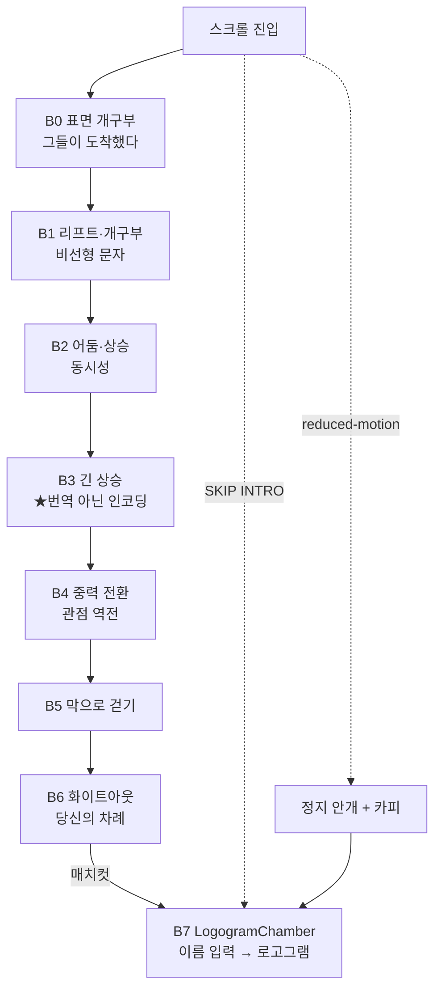

# Heptapod B Encoder — Hero Intro Storyline

> 영상 스크러빙 기반 히어로 인트로의 **스토리라인 + 스크롤당 컨텐츠 배치** 문서.
> 세계관(헵타포드 B) · 영상 스토리(Shot 02→11, 47s) · 메인 체험(이름 인코더)을 하나의 내러티브로 연결한다.
> 선행 문서: `01-project-summary.md`(세계관/기능), `02-ux-flow.md`(인코더 플로우), `05-hero-cinematic-prompt-template.md`(샷 시퀀스).

---

## 0. 확정 방향 (결정 게이트 결과)

| 결정 | 선택 | 근거 |
|------|------|------|
| 스크롤 길이/페이싱 | **560vh 선형** (영상 1s ≈ 12vh) | 균일한 페이싱·단순 구현. 카피는 느린 영상 구간에 배치해 dwell 확보 |
| 세계관 카피 톤/밀도 | **절제된 시네마틱** | 비트당 1~2줄, 여백 중심. "정직한 인코더" 무드. 영상이 주연, 텍스트는 자막처럼 |
| 인코더 연결 프레이밍 | **대화/응답 프레임** | "그들이 먼저 말했다 → 당신이 답한다". 영상=발화, 인코더=응답. 양방향 첫 접촉 서사 |

---

## 1. 내러티브 척추

> **"그들이 먼저 말을 걸었다. 이제 당신이 답한다."**

- 영상(47s)은 **그들(헵타포드)의 발화이자 초대** — 비행체 진입부터 접촉막에 다가서는 여정.
- 스크롤하는 행위 자체가 **접촉면(fog membrane)을 향해 다가가는 이동**이 된다.
- 막에 도착 = 인코더 도착 = **당신이 말할 차례**. 영상 끝의 화이트아웃 안개막이 라이브 `LogogramChamber` 안개로 매치컷된다.
- 메인 체험(이름 입력 → 로고그램)은 곧 **당신의 첫 단어(응답)**이며, "번역이 아니라 인코딩"이라는 프로젝트 명제로 착지한다.

### 3개 레이어 연결

| 레이어 | 핵심 | 스토리라인 역할 |
|--------|------|----------------|
| **세계관** | 헵타포드 B 문자 = 순서 없는 동시적 사고 단위. 언어가 시간 지각을 바꾼다(사피어-워프) | 카피 비트로 점진 주입 |
| **영상(Shot 02→11)** | 진입 → 상승 → 중력 전환 → 막을 향해 걷기 | "첫 접촉으로 다가감"의 물리적 여정 |
| **체험(인코더)** | 이름 → 하나의 로고그램(사고 단위). 결정론 | 막 앞에서의 **응답** = 당신의 첫 단어 |

---

## 2. 영상 타임라인 (실측 기준)

최종 히어로 영상: `public/heptapod-b-encoder/hero-motion/kling-audio-01-final/kling-audio-01-final-hero-v1-source01v2-screenfillv4.mp4` → **47.08s**

| 구간 | Shot | 내용 | 페이싱 |
|------|------|------|--------|
| 00–04s | 02 | 외계 표면이 직접 갈라져 둥근 사각 개구부 생성 | 빠름 |
| 04–12s | 02→03 | 리프트가 개구부 아래 대기·진입 (8s) | **느림(읽기 적합)** |
| 12–17s | 03→05 | 리프트 상승 + 어둠 속으로 클로즈 | 보통 |
| 17–23s | 05→07 | 내부 정착 + 수직 상승 시작 | 보통 |
| 23–29s | 07→09 | 멀리 있는 천장 접촉막을 향한 긴 상승 | **억제됨(읽기 최적)** |
| 29–35s | 09→10 | 90도 중력 전환 + 착륙(prewalk) | 전환점 |
| 35–41s | 10→11 | 하차 후 광막(fog wall)으로 걷기 | 액션 |
| 41–47s | 11 | screen-fill push → 화이트아웃(full fog) | 매치컷 |

---

## 3. 스크롤당 컨텐츠 배치

스크롤 = 영상 스크럽(`VideoScrubbing.onProgressChange`). 카피 비트는 **느린/억제된 구간**(04–12s, 23–29s)에 얹어 읽을 시간을 벌고, 액션 구간(중력 전환·screen-fill)은 텍스트를 비워 비주얼이 호흡하게 한다.

컨테이너 **560vh**, 영상 1s ≈ 12vh 선형 매핑.

**카피 구조**: `headline` = 모던 serif 영문 / `body` = 한글 본문. 데이터는 `src/data/heptapodHeroStory.js`(`HERO_STORY_BEATS`)에 상수화 — **이 표가 아니라 상수 파일이 단일 출처**.

| # | 스크롤 % (vh) | 영상 | Shot | 비주얼 | Headline (serif EN) | Body (KO) | 거동 |
|---|---|---|---|---|---|---|---|
| **B0** | 0–8% (0–45vh) | 0–4s | 02 | 표면이 갈라짐 | *They Arrived* | 그들은 도착했고, 먼저 말을 건넸다. | `HEPTAPOD B` 타이틀 페이드인, ↓ 스크롤 힌트 |
| **B1** | 8–25% (45–140vh) | 4–12s | 02→03 | 리프트·개구부 (느림) | *A Sentence, All at Once* | 그들의 문장은 한 번에 그려진다. 시작도 끝도 없이, 하나의 원으로. | 비선형성 도입, 긴 dwell |
| **B2** | 25–49% (140–275vh) | 12–23s | 03→07 | 어둠 진입·상승 시작 | *No Before, No After* | 먼저와 나중이 같은 순간에 존재한다. | 동시성(simultaneity) |
| **B3** | 49–62% (275–347vh) | 23–29s | 07→09 | 막을 향한 긴 상승 (억제) | ***Not Translation, but Encoding*** | **당신의 이름은 소리로 옮겨지지 않는다. 다만 하나의 사고로 응축된다.** | **명제 비트(핵심)**, 읽기 최적 |
| **B4** | 62–75% (347–420vh) | 29–35s | 09→10 | 중력 90도 전환·착륙 | *Perspective Inverts* | 벽이 바닥이 되는 곳에서, 관점이 뒤집힌다. | 한 줄, 비주얼 우선 |
| **B5** | 75–87% (420–487vh) | 35–41s | 10→11 | 막으로 걷기 | (무카피) | (무카피) | 텍스트 최소화 |
| **B6** | 87–100% (487–560vh) | 41–47s | 11 | screen-fill → 화이트아웃 | *Your Turn to Answer* | 이제, 당신이 답할 차례입니다. | CTA 페이드인 → 매치컷 |
| **B7** | 스크롤락 해제 | — | live | `LogogramChamber` 라이브 | — | 입력 필드 등장 | 인터랙티브 인코더 시작 |

> 톤 가드: 비트당 영문 헤드라인 1줄 + 한글 본문 1~2줄, 여백 중심. 영상이 주연이고 텍스트는 자막처럼 보조한다. 과한 수식·이모지·불릿 금지. 타이포 스펙은 `03-visual-direction.md` §8 참조.

---

## 4. 스크롤 메커니즘

- **Pin/Sticky**: 히어로 컨테이너 `560vh`, 내부 영상은 `position: sticky; height: 100vh`로 고정. 스크롤 진행도가 `VideoScrubbing`으로 들어가고, 동일 진행도로 카피 비트 opacity를 제어한다.
- **카피 비트 노출**: 각 비트는 자신의 스크롤 % 구간에서 fade-in → 유지 → fade-out (구간 경계 ±3%에서 크로스). 기존 `FadeTransition` 재활용.
- **스크럽/디졸브 분리(중요)**: 영상은 트랙 앞 **0→85%** 구간에서 전 구간 스크럽을 끝내 마지막 프레임(whiteout)에 도달하고, **85%→100%**는 영상을 마지막 프레임에 고정한 채 디졸브만 한다. 이렇게 분리하지 않으면 영상 끝부분이 페이드 뒤로 가려져 왕복 시 "건너뛰는" 현상이 생긴다. 구현: 디졸브/카피용 마스터 진행도는 Framer `useScroll`(전 구간 0→1), 영상 스크럽은 `VideoScrubbing` `scrollRange.end = scrollEnd × 0.85`로 캡(이후 progress>1 clamp로 마지막 프레임 고정).
- **핸드오프(B6→B7)**: 인코더 캔버스는 인트로의 **children(크로스페이드 타깃)**으로 같은 고정 뷰포트에 항상 마운트된다. 85%→100%에서 **영상·오버레이 fade-out / 캔버스 fade-in** 디졸브로 매치컷(양쪽 쿨 시안 안개라 이음새 없음). **언마운트 없음** — 인코더가 항상 마운트되어 스테이지 측정(ResizeObserver) 등 마운트 effect가 정상 동작. SKIP/ENTER는 트랙 끝으로 `scrollTo`해 디졸브 완료.
- **진입=탈출 대칭(중요)**: 디졸브 opacity(`videoOpacity`/`canvasOpacity`)는 **항상 progress만** 따른다 → 아래로 내릴 때와 위로 올릴 때가 완전히 거울 대칭. 한쪽을 고정하거나 급변시키지 않는다. (이전엔 도킹이 opacity까지 강제해 "진입=디졸브 / 탈출=고정 후 하드컷"이라는 비대칭이 있었음 — 제거.)
- **도킹 히스테리시스(상호작용 전용)**: 완전 진입 후 미세 스크롤에 상호작용이 끊기는 knife-edge를 막기 위해, **`pointerEvents`에만** 진입(0.995)/해제(0.85) 임계값을 분리 적용한다. 상호작용은 (1.0~0.85) 버퍼만큼 유지되어 미세 스크롤에 끊기지 않으며, **opacity·시각에는 전혀 관여하지 않는다**(토글이 보이지 않음). 디졸브/스크럽이 분리돼 있어 복귀 시 영상이 마지막 프레임부터 역스크럽되어 건너뛰는 구간도 없다.
- **`scrollRange` 메모이즈 필수**: `VideoScrubbing`의 rAF effect 의존성에 `scrollRange`가 들어있어, 매 렌더 새 객체를 넘기면 docked 토글 re-render마다 effect가 teardown→재시작된다. 그러면 도킹 경계(0.85)를 스크롤로 지날 때 rAF 갭 동안 `currentTime`이 밀렸다 튀는 "영상 갑툭튀"가 발생한다. → `useMemo([videoScrubEnd])`로 객체 동일성을 유지해 rAF 루프를 끊김 없이 유지한다.
- **per-frame 강제 리플로우 제거**: `VideoScrubbing`이 매 프레임 `offsetTop/offsetHeight`를 읽으면 강제 리플로우가 발생해, 인코더 활성 상태의 역스크럽에서 프레임 드랍·점핑을 유발한다. → 메트릭을 한 번만 측정해 캐시(resize 때만 갱신), per-frame엔 `scrollY`만 읽는다. 컨테이너엔 `overflow-anchor: none`으로 스크롤 앵커링 점핑도 차단.
- **방향 인지 듀얼 비디오(진입=역방향 100% 동일)**: `<video>`는 forward seek는 디코더 파이프라인을 이어가지만 **backward seek는 flush·재시작**되어 역스크럽만 끊긴다(영상이 전부 all-keyframe이어도 동일). → **역재생 클립**(`HERO_VIDEO_REVERSE_SRC`, frames reversed)을 따로 두고, 아래로 스크롤은 원본을, 위로 스크롤은 역클립을 **각각 forward-seek**한다. `reverse@D·(1−p) = forward@D·p`(동일 프레임)이라 전환이 매끄럽고, 두 클립 모두 forward seek만 하므로 진입/역방향 디코드 비용이 같다. 가시성 스왑은 대상 클립이 해당 프레임에 도달(seek 완료)했을 때만 수행해 플래시를 없앤다. 트레이드오프: 두 클립을 preload하므로 대역폭 약 2배(≈59MB).
- **오디오 봉합**: B6 도달 시 `ambientAudio.encodeStart`의 boom 톤을 매치컷에 동기화 가능(`04-audio-and-motion.md` §1.1). 배경음악(OST)은 인트로 내내 default-on 유지.
- **`prefers-reduced-motion`**: 스크럽/핀 생략 → 마지막 안개 정지 프레임 + 카피 순차 노출 후 바로 인코더 노출 (프로젝트 룰 준수).
- **Skip**: 우상단 `SKIP INTRO →` → 즉시 B7로 점프. URL 공유 진입(`?name=` 쿼리)은 기본 skip 권장 — 재현 우선.

---

## 5. 흐름도

---

## 6. 컴포넌트 매핑 (구현 시)

| 역할 | 컴포넌트 | 구분 |
|------|----------|------|
| 컨텐츠 데이터(상수) | `data/heptapodHeroStory.js` | 신규 — 비트·영상·스크롤 상수 |
| 영상 스크럽 | `components/scroll/VideoScrubbing.jsx` | 재활용 |
| 카피 비트 등장 | `components/motion/FadeTransition.jsx` | 재활용 |
| 인트로→챔버 핸드오프 컨테이너 | (신규) `HeptapodHeroIntro` | 신규 — 카테고리 `templates` 또는 `motion` |
| 라이브 챔버 | `components/motion/LogogramChamber.jsx` | 기존 |
| 통합 지점 | `components/templates/HeptapodEncoderPage.jsx` 위 인트로 오버레이 | 수정 |

> 다음 구현 타깃(`05` 문서 §10): `HeptapodEncoderPage` 위 인트로 오버레이 → 라이브 `LogogramChamber`로 페이드아웃.

---

## 7. 미결 사항

- B5 무카피 확정 여부(접촉 직전 1줄 추가 옵션: "접촉면 앞에 서다.")
- 카피 한/영 병기 여부 (세계관 무드상 영문 보조 캡션 고려 가능)
- 모바일 스크롤 길이 축소(560vh → ~420vh) 분기 필요성
